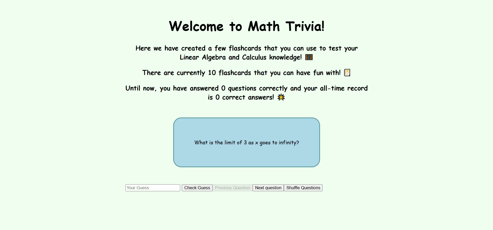

# WEB102 Project 2 - Math Trivia

Submitted by: **Edgar Palomino**

**Math Trivia** is a website where students can see practice questions to study for both calculus and linear algebra.

Time spent: **5** hours spent in total

## Required Features

The following **required** functionality is completed:

* [X] The app displays the title of the card set, a short description, and the total number of cards.
* [X] A single card at a time is displayed.
* [X] Clicking on the card flips the card over, showing the corresponding component of the information pair.
* [X] Clicking on the next button displays a random new card.

The following **optional** features are implemented:

* [X] Cards contain images in addition to or in place of text.
* [X] Cards have different visual styles such as color based on their category.

## Video Walkthrough

Here's a walkthrough of implemented features:

GIF created with ScreenToGif

## Notes

It was a bit difficult for me to figure out how to get the flashcard animation working and also how to update the questions and answers for each flashcard. However, in the end I was able to understand how CSS transitions and React states can be used to achieve these two things!

## License

    Copyright [2025] [Edgar Palomino]

    Licensed under the Apache License, Version 2.0 (the "License");
    you may not use this file except in compliance with the License.
    You may obtain a copy of the License at

        http://www.apache.org/licenses/LICENSE-2.0

    Unless required by applicable law or agreed to in writing, software
    distributed under the License is distributed on an "AS IS" BASIS,
    WITHOUT WARRANTIES OR CONDITIONS OF ANY KIND, either express or implied.
    See the License for the specific language governing permissions and
    limitations under the License.
